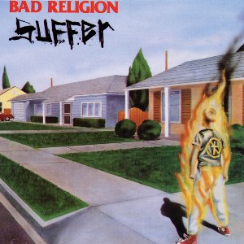
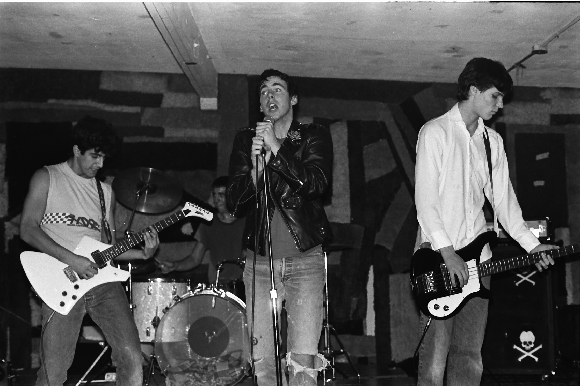
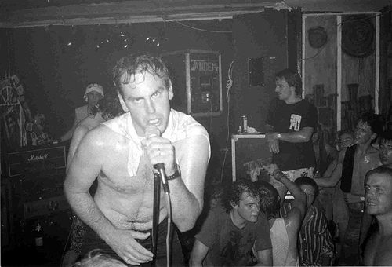

#Bad :no_entry_sign: Religion 

Lyrics to songs from **Bad Religion**'s third album, _Suffer_:

Image Credit: Jason Torres :bangbang:

The *Bad Religion*:bangbang: song *"You are the government"* on the album [Suffer](link1).

 

Creating a *fork* is producing a personal copy of someone else's project. Forks act as a sort of bridge between the original repository and your personal copy. You can submit *Pull Requests* to help make other people's projects better by offering your changes up to the original project. Forking is at the core of social coding at GitHub.

After forking this repository, you can make some changes to the project, and submit [a Pull Request](https://github.com/octocat/Spoon-Knife/pulls) as practice.

For some more information on how to fork a repository, [check out our guide, "Forking Projects""](http://guides.github.com/overviews/forking/). Thanks! :sparkling_heart:

[link1]: http://en.wikipedia.org/wiki/Suffer_%28album%29

